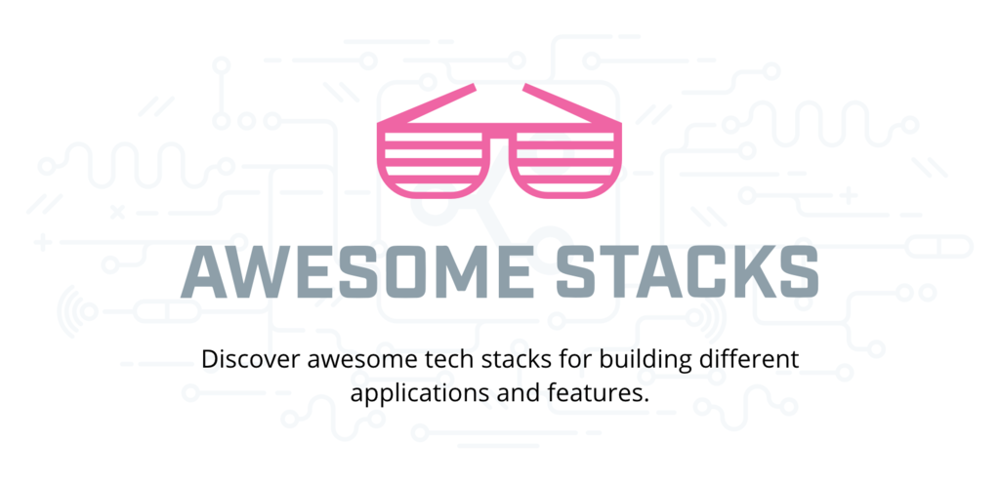

  

# Awesome Stacks

> Tech stacks for building different applications and features.

## Contents

- [Front-end](#front-end)
- [Full stack](#full-stack)
- [Back-end](#back-end)
- [Mobile](#mobile)

Awesome Stacks is a community-curated list of tech stacks for building different applications and features. It is open source and inspired by the original [awesome list](http://awesome.re/).

Each stack in the list has a name, description, and list of a few of the key tools and technologies. Optionally, it links to a tutorial, starter kit or boilerplate that makes it easy to get started with.

Got a stack you think is a great way to build something? Please edit this file and add it! Check out [CONTRIBUTING.md](CONTRIBUTING.md) for more information.

#### Browsing the stacks

Stacks can be browsed in two places—on the README and on [awesomestacks.dev](https://awesomestacks.dev/). The site, built with Gatsby and React, displays logos and metrics about each tool listed in the README by pulling data from the GitHub and StackShare APIs.

#### Legend

🛠 - StackShare tool profile 
🐙 - GitHub repository

## Front-end

### React Next Boilerplate [↗](https://awesomestacks.dev/react-next-boilerplate)

A basis for reducing the configuration of your projects with Next.js, best development practices and popular libraries in the developer community.

- [Next.js](https://nextjs.org/) - [🛠](https://stackshare.io/next-js) - [🐙](https://github.com/zeit/next.js) - The React Framework for server rendering, static websites, PWAs.
- [React Testing Library](https://testing-library.com/docs/react-testing-library/intro) - [🛠](https://stackshare.io/react-testing-library) - [🐙](https://github.com/testing-library/react-testing-library) - react-testing-library is a tool in the Testing Frameworks category of a tech stack.
- [Emotion](https://emotion.sh/) - [🛠](https://stackshare.io/emotion) - [🐙](https://github.com/emotion-js/emotion) - CSS-in-JS library designed for high performance style composition.
- [I18next](https://www.i18next.com/) - [🐙](https://github.com/i18next/i18next) - I18next is an internationalization-framework written in and for JavaScript. But it's much more than that.
- [Redux Saga](https://redux-saga.js.org/) - [🐙](https://github.com/redux-saga/redux-saga) - is a library that aims to make application side effects (i.e. asynchronous things like data fetching and impure things like accessing the browser cache) easier to manage, more efficient to execute, easy to test, and better at handling failures.

##### Resources

- [react-next-boilerplate](https://github.com/react-next-boilerplate/react-next-boilerplate)

### React starter kit [↗](https://awesomestacks.dev/react-starter-kit)

React Starter Kit is an opinionated boilerplate for web development built on top of Node.js, Express, GraphQL and React, containing modern web development tools such as Webpack, Babel and Browsersync.

- [React](https://reactjs.org/) - [🛠](https://stackshare.io/react) - [🐙](https://github.com/facebook/react) - React components can be used on the client and server side.
- [Webpack](https://webpack.js.org/) - [🛠️](https://stackshare.io/webpack) - [🐙](https://github.com/webpack/webpack) - A static module bundler for modern JavaScript applications.
- [GraphQL](https://graphql.org/) - [🛠](https://stackshare.io/graphql) - [🐙](https://github.com/graphql/graphql-js) - A query language for APIs and a runtime for fulfilling those queries with your existing data.
- [Babel](https://babeljs.io/) - [🛠️](https://stackshare.io/babel) - [🐙](https://github.com/babel/babel) - A JavaScript compiler; use next generation JavaScript, today.
- [Express](https://expressjs.com/) - [🛠️](https://stackshare.io/expressjs) - [🐙](https://github.com/expressjs/express) - A minimal and flexible Node.js web application framework.
- [Node.js](https://nodejs.org/) - [🛠️](https://stackshare.io/nodejs) - [🐙](https://github.com/nodejs/node) - A JavaScript runtime built on Chrome's V8 JavaScript engine.

##### Resources

- [react-starter-kit](https://github.com/kriasoft/react-starter-kit)

### React Firebase starter [↗](https://awesomestacks.dev/react-firebase-starter)

React Starter Kit for Firebase is a popular project template (aka, boilerplate) for building modern, scalable web applications with React, Relay, and GraphQL using serverless infrastructure provided by Google Cloud (Cloud SQL, Cloud Functions, CDN hosting, and file storage).

- [Firebase](https://firebase.google.com/) - [🛠️](https://stackshare.io/firebase) - A cloud-hosted NoSQL database that lets you store and sync data between your users in real-time.
- [Create React App](https://facebook.github.io/create-react-app/) - [🛠](https://stackshare.io/create-react-app) - [🐙](https://github.com/facebook/create-react-app) - Set up a modern web app by running one command.
- [Material UI](https://material-ui.com/) - [🛠️](https://stackshare.io/material-ui) - [🐙](https://github.com/mui-org/material-ui) - React components that implement Google's Material Design.
- [Relay](https://facebook.github.io/relay/) - [🛠️](https://stackshare.io/relay) - [🐙](https://github.com/facebook/relay) - A JavaScript framework for building data-driven React applications.
- [GraphQL](https://graphql.org/) - [🛠](https://stackshare.io/graphql) - [🐙](https://github.com/graphql/graphql-js) - A query language for APIs and a runtime for fulfilling those queries with your existing data.

##### Resources

- [react-firebase-starter](https://github.com/kriasoft/react-firebase-starter)

### vue-starter [↗](https://awesomestacks.dev/vue-starter)

The most complete boilerplate for production-ready PWAs. With focus on performance, development speed, and best practices.

- [Vue.js](https://vuejs.org/) - [🛠️](https://stackshare.io/vue-js) - [🐙](https://github.com/vuejs/vue) - An approachable core library that focuses on the view layer only.
- [TypeScript](https://www.typescriptlang.org/) - [🛠️](https://stackshare.io/typescript) - [🐙](https://github.com/Microsoft/TypeScript) - A typed superset of JavaScript that compiles to plain JavaScript.
- [Jest](https://jestjs.io/) - [🛠️](https://stackshare.io/jest) - [🐙](https://github.com/facebook/jest) - A comprehensive, delightful JavaScript testing solution.
- [Prettier](https://prettier.io/) - [🛠️](https://stackshare.io/prettier) - [🐙](https://github.com/prettier/prettier) - An opinionated code formatter.
- [Vuex](https://vuex.vuejs.org/) - [🐙](https://github.com/vuejs/vuex) - Centralized State Management for Vue.js.
- [Vue Router](https://router.vuejs.org/) - [🐙](https://github.com/vuejs/vue-router) - Vue Router is the official router for Vue.js.

##### Resources

- [vue-starter](https://vue-starter.herokuapp.com/docs/)

### Vue Enterprise Boilerplate [↗](https://awesomestacks.dev/vue-enterprise-boilerplate)

An ever-evolving and opinionated architecture and dev environment for new Vue SPA projects using Vue CLI 3.

- [Vue.js](https://vuejs.org/) - [🛠️](https://stackshare.io/vue-js) - [🐙](https://github.com/vuejs/vue) - An approachable core library that focuses on the view layer only.
- [Vuex](https://vuex.vuejs.org/) - [🐙](https://github.com/vuejs/vuex) - Centralized State Management for Vue.js.
- [Vue Router](https://router.vuejs.org/) - [🐙](https://github.com/vuejs/vue-router) - Vue Router is the official router for Vue.js.
- [Vue CLI](https://cli.vuejs.org/) - [🐙](https://github.com/vuejs/vue-cli) - An approachable core library that focuses on the view layer only.
- [Babel](https://babeljs.io/) - [🛠️](https://stackshare.io/babel) - [🐙](https://github.com/babel/babel) - compiler for writing next generation JavaScript; Babel will turn your ES6+ code into ES5 friendly code, so you can start using it right now without waiting for browser support.
- [Sass](https://sass-lang.com) - [🛠️](https://stackshare.io/sass) - [🐙](https://github.com/sass/sass) - Sass is an extension of CSS3, adding nested rules, variables, mixins, selector inheritance, and more. It's translated to well-formatted, standard CSS using the command line tool or a web-framework plugin.

##### Resources

- [vue-enterprise-boilerplate](https://github.com/chrisvfritz/vue-enterprise-boilerplate)

### Progressive Web App with Gatsby [↗](https://awesomestacks.dev/progressive-web-app-with-gatsby)

Build a simple polling progressive web application with some great modern tech.

- [Gatsby](https://gatsbyjs.org/) - [🛠](https://stackshare.io/gatsbyjs) - [🐙](https://github.com/gatsbyjs/gatsby) - Gatsby is a blazing fast modern site generator for React.
- [Cloud Firestore](https://firebase.google.com/docs/firestore/) - [🛠️](https://stackshare.io/cloud-firestore) - A noSQL cloud database that exposes event listeners for real-time updates.
- [Netlify](https://netlify.com/) - [🛠️](https://stackshare.io/netlify) - Netlify is a global CDN that makes continuous deployments as simple as a few clicks.
- [styled components](https://www.styled-components.com/) - [🛠](https://stackshare.io/styled-components) - [🐙](https://github.com/styled-components/styled-components) - A react-specific css-in-js solution.
- [Contentful](https://www.contentful.com/) - [🛠](https://stackshare.io/contentful) - [🐙](https://github.com/contentful) - Contentful is a flexible and future-friendly content platform that helps editors to manage and developers to serve content into mobile or web applications. Last but not least a powerhouse when worked with Gatsby.

##### Resources

- [JAMstack PWA — Let’s Build a Polling App. with Gatsby.js, Firebase, and Styled-components](https://medium.com/@UnicornAgency/jamstack-pwa-lets-build-a-polling-app-with-gatsby-js-firebase-and-styled-components-pt-1-78a03a633092)
- [Learn how to easily build a GatsbyJS website powered by Contentful](https://www.contentful.com/r/knowledgebase/gatsbyjs-and-contentful-in-five-minutes/)

### Victor Hugo boilerplate [↗](https://awesomestacks.dev/victor-hugo-boilerplate)

A Hugo boilerplate for creating truly epic websites. This is a boilerplate for using Hugo as a static site generator and Webpack as your asset pipeline.

- [Hugo](https://gohugo.io/) - [🛠](https://stackshare.io/hugo_2)- [🐙](https://github.com/gohugoio/hugo) - The world’s fastest framework for building websites.
- [Webpack](https://webpack.js.org/) - [🛠️](https://stackshare.io/webpack) - [🐙](https://github.com/webpack/webpack) - A static module bundler for modern JavaScript applications.
- [Babel](https://babeljs.io/) - [🛠️](https://stackshare.io/babel) - [🐙](https://github.com/babel/babel) - A JavaScript compiler; use next generation JavaScript, today.
- [PostCSS](https://postcss.org/) - [🛠](https://stackshare.io/postcss) - [🐙](https://github.com/postcss/postcss) - A tool for transforming CSS with JavaScript.

##### Resources

- [netlify-templates/victor-hugo](https://github.com/netlify-templates/victor-hugo)

### Nuxt, TypeScript + Docker [↗](https://awesomestacks.dev/nuxt-type-script-docker)

Bleeding edge vue template focused on code quality and developer happiness.

Offers a complete setup for both small and enterprise-scale apps.

- [Nuxt](https://nuxtjs.org/) - [🛠](https://stackshare.io/nuxt) - [🐙](https://github.com/nuxt/nuxt.js) - Vue.js Meta Framework to create complex, fast & universal web applications quickly.
- [TypeScript](https://www.typescriptlang.org/) - [🛠️](https://stackshare.io/typescript) - [🐙](https://github.com/Microsoft/TypeScript) - A typed superset of JavaScript that compiles to plain JavaScript.
- [Sass](https://sass-lang.com) - [🛠️](https://stackshare.io/sass) - [🐙](https://github.com/sass/sass) - Sass is an extension of CSS3, adding nested rules, variables, mixins, selector inheritance, and more. It's translated to well-formatted, standard CSS using the command line tool or a web-framework plugin.
- [Jest](https://jestjs.io/) - [🛠️](https://stackshare.io/jest) - [🐙](https://github.com/facebook/jest) - A comprehensive, delightful JavaScript testing solution.
- [eslint](https://eslint.org/) - [🛠️](https://stackshare.io/eslint) - [🐙](https://github.com/eslint/eslint) - The pluggable linting utility for JavaScript and JSX.
- [stylelint](https://stylelint.io/) - [🛠️](https://stackshare.io/stylelint) - [🐙](https://github.com/stylelint/stylelint) - A mighty, modern linter that helps you avoid errors and enforce conventions in your styles.
- [Docker](https://www.docker.com/) - [🛠](https://stackshare.io/docker) - [🐙](https://github.com/docker/docker) A tool to create, deploy and run applications inside containers.

##### Resources

- [wemake-vue-template](https://github.com/wemake-services/wemake-vue-template)

## Full stack

### GraphCMS React + Apollo [↗](https://awesomestacks.dev/graph-cms-react-apollo)

Lightning fast starter for bloggers, content creators, and really anyone who wants to break free from WordPress.

- [GraphCMS](https://graphcms.com/) - [🛠️](https://stackshare.io/graphcms) - GraphCMS providing a backend to your app, giving you the tools to manage content.
- [Create React App](https://facebook.github.io/create-react-app/) - [🛠](https://stackshare.io/create-react-app) - [🐙](https://github.com/facebook/create-react-app) - Set up a modern web app by running one command.
- [Apollo](https://www.apollographql.com/) - [🛠️](https://stackshare.io/apollo) - [🐙](https://github.com/apollographql/apollo-client) - Apollo Client is the best way to use GraphQL to build client applications.

##### Resources

- [GraphCMS starter blog with React & Apollo Client](https://github.com/GraphCMS/graphcms-examples/tree/master/current/react-apollo-blog)

### Strapi CMS with Gatsby [↗](https://awesomestacks.dev/strapi-cms-with-gatsby)

Use Strapi CMS to maintain and manage your Gatsby static site. Deploy to Heroku.

- [Strapi CMS](https://strapi.io) - [🐙](https://github.com/strapi/strapi) - Strapi is the Headless CMS developers love.
- [Gatsby](https://gatsbyjs.org/) - [🛠](https://stackshare.io/gatsbyjs) - [🐙](https://github.com/gatsbyjs/gatsby) - Gatsby is a blazing fast modern site generator for React.
- [Heroku](https://www.heroku.com/) - [🛠️](https://stackshare.io/heroku) - Heroku is a powerful platform for deploying your apps.

##### Resources

- [Building a Static Blog using Gatsby and Strapi](https://blog.strapi.io/building-a-static-website-using-gatsby-and-strapi/)
- [Learn Gatsby with Strapi Headless CMS Video Series](https://www.youtube.com/playlist?list=PL7Q0DQYATmvgGiz0MbbsMA_aB1V0yLE7a)
- [Deploying Strapi to Heroku](https://strapi.io/documentation/3.x.x/guides/deployment.html#heroku)

### Algolia site search [↗](https://awesomestacks.dev/algolia-site-search)

Add search to your JAMStack website, through a static site integration or by crawling the content.

- [Algolia](https://algolia.com/) - [🛠](https://stackshare.io/algolia) - Hosted search API, free up to 10,000 records.
- [DocSearch](https://community.algolia.com/docsearch) - [🐙](https://github.com/algolia/docsearch-scraper) - Crawls a website and uploads it to an index.
- [gatsby-plugin-algolia](https://www.gatsbyjs.org/packages/gatsby-plugin-algolia/) - [🐙](https://github.com/algolia/gatsby-plugin-algolia) - Use GraphQL to specify Gatsby object to index with Algolia (beta).
- [hugo-algolia](https://github.com/replicatedhq/hugo-algolia) - [🐙](https://github.com/replicatedhq/hugo-algolia) - Generate and send indices from Hugo static sites for use with Algolia.
- [instantsearch.js](https://www.algolia.com/doc/guides/building-search-ui/what-is-instantsearch/js/) - [🐙](https://github.com/algolia/instantsearch.js) - JavaScript library for building performant and instant search experiences.

##### Resources

- [Static site search with Hugo + Algolia](https://forestry.io/blog/search-with-algolia-in-hugo/)

### MEVN: Mongo Express Vue Node [↗](https://awesomestacks.dev/mevn-mongo-express-vue-node)

This is a full stack web app boilerplate project with VueJS + ExpressJS + MongoDB.

- [Vue.js](https://vuejs.org/) - [🛠️](https://stackshare.io/vue-js) - [🐙](https://github.com/vuejs/vue) - An approachable core library that focuses on the view layer only.
- [MongoDB](https://www.mongodb.com/) - [🛠️](https://stackshare.io/mongodb) - [🐙](https://github.com/mongodb/mongo) - A document and JSON-oriented database.
- [Express](https://expressjs.com/) - [🛠️](https://stackshare.io/expressjs) - [🐙](https://github.com/expressjs/express) - A minimal and flexible Node.js web application framework.
- [Node.js](https://nodejs.org/en/) - [🛠️](https://stackshare.io/nodejs) - [🐙](https://github.com/nodejs/node) - Node.js is a JavaScript runtime built on Chrome's V8 JavaScript engine.

##### Resources

- [Welcome to Vue-Express-Mongo BoilerPlate](http://vemapp.moleculer.services/)

### Rock Solid Modern Rails [↗](https://awesomestacks.dev/rock-solid-modern-rails)

A Rails/JavaScript-based stack with modern/developer friendly technologies

- [Rails](https://rubyonrails.org/) - [🛠](https://stackshare.io/rails) - [🐙](https://github.com/rails/rails) - An established web app framework with a focus on simplicity and productivity.
- [React](https://reactjs.org/) - [🛠](https://stackshare.io/react) - [🐙](https://github.com/facebook/react) - React components can be used on the client and server side.
- [GraphQL Ruby](https://graphql-ruby.org/) - [🛠](https://stackshare.io/graphql-ruby) - [🐙](https://github.com/rmosolgo/graphql-ruby) - Ruby server implementation of the GraphQL specification.
- [Apollo Client](https://dev.apollodata.com/) - [🛠](https://stackshare.io/apollo) - [🐙](https://github.com/apollographql/apollo-client) - A powerfully extensible GraphQL JavaScript client.
- [Heroku](https://heroku.com) - [🛠️](https://stackshare.io/heroku) Developer friendly web app infrastructure provider with seamless Ruby/Rails support.

##### Resources

- [A Rock Solid, Modern Web Stack—Rails 5 API + ActiveAdmin + Create React App on Heroku](https://blog.heroku.com/a-rock-solid-modern-web-stack)

### Serverless Stack with React on AWS [↗](https://awesomestacks.dev/serverless-stack-with-react-on-aws)

Learn how to build a full-stack production ready note taking app using Serverless and React on AWS from serverless-stack.com. Step-by-step open-source tutorials with screenshots and code samples included.

- [Serverless Framework](https://serverless.com/) - [🛠️](https://stackshare.io/serverless) - [🐙](https://github.com/serverless/serverless) - A toolkit for building serverless applications.
- [AWS Lambda](https://aws.amazon.com/lambda) - [🛠️](https://stackshare.io/aws-lambda) - A compute service that runs your code in response to events.
- [DynamoDB](http://aws.amazon.com/dynamodb/) - [🛠️](https://stackshare.io/amazon-dynamodb) - Fully managed NoSQL database service.
- [Amazon Cognito](https://aws.amazon.com/cognito/) - [🛠️](https://stackshare.io/amazon-cognito) - Securely manage and synchronize app data for your users across their mobile devices.
- [Amazon S3](https://aws.amazon.com/s3/) - [🛠️](https://stackshare.io/amazon-s3) - Store and retrieve any amount of data, at any time, from anywhere on the web.
- [AWS Amplify](https://aws-amplify.github.io/) - [🛠️](https://stackshare.io/aws-amplify) - JavaScript Open Source Library with React, React Native Extensions.
- [Amazon CloudFront](https://aws.amazon.com/cloudfront/) - [🛠️](https://stackshare.io/amazon-cloudfront) - Content delivery with low latency and high data transfer speeds.
- [Create React App](https://facebook.github.io/create-react-app/) - [🛠](https://stackshare.io/create-react-app) - [🐙](https://github.com/facebook/create-react-app) - Set up a modern web app by running one command.

##### Resources

- [serverless-stack.com](https://serverless-stack.com/)

### Electron React Boilerplate [↗](https://awesomestacks.dev/electron-react-boilerplate)

A foundation for scalable cross-platform desktop apps all the way from development to distributing your app.

- [Electron](http://electron.atom.io/) - [🛠️](https://stackshare.io/electron) - [🐙](https://github.com/electron/electron) - Build cross-platform desktop apps with JavaScript, HTML, and CSS.
- [React](https://reactjs.org/) - [🛠](https://stackshare.io/react) - [🐙](https://github.com/facebook/react) - React components can be used on the client and server side.
- [Redux](https://redux.js.org/) - [🛠](https://stackshare.io/reduxjs) - [🐙](https://github.com/reduxjs/redux) - Predictable state container for JavaScript apps.
- [electron-builder](https://www.electron.build) - [🐙](https://github.com/electron-userland/electron-builder) - A complete solution to package and build a ready for distribution Electron app with “auto update” support out of the box.

##### Resources

- [Electron React Boilerplate website](https://electron-react-boilerplate.js.org/)

### Vue with Electron [↗](https://awesomestacks.dev/vue-with-electron)

A foundation for scalable cross-platform desktop apps all the way from development to distributing your app using Vue and Electron.

- [Electron](http://electron.atom.io/) - [🛠️](https://stackshare.io/electron) - [🐙](https://github.com/electron/electron) - Build cross-platform desktop apps with JavaScript, HTML, and CSS.
- [Vue.js](https://vuejs.org/) - [🛠️](https://stackshare.io/vue-js) - [🐙](https://github.com/vuejs/vue) - An approachable core library that focuses on the view layer only.
- [Vuex](https://redux.js.org/) - [🛠](https://stackshare.io/reduxjs) - [🐙](https://github.com/reduxjs/redux) - Predictable state container for JavaScript apps.
- [Vue Router](https://router.vuejs.org/) - [🐙](https://github.com/vuejs/vue-router) - Vue Router is the official router for Vue.js.
- [Vue CLI](https://cli.vuejs.org/) - [🐙](https://github.com/vuejs/vue-cli) - An approachable core library that focuses on the view layer only.
- [electron-builder](https://www.electron.build) - [🐙](https://github.com/electron-userland/electron-builder) - A complete solution to package and build a ready for distribution Electron app with “auto update” support out of the box.

##### Resources

- [Vue.js & Electron: The easy way. – Mikeal](https://medium.com/@mikeal/vue-js-electron-the-easy-way-adc3ca09234a)
- [How to use Vue.js with Electron and Vuex](https://alligator.io/vuejs/vue-electron/)

### Code Coverage & CI [↗](https://awesomestacks.dev/code-coverage-and-ci)

Quickest way to get started with CI and Code Coverage.

- [CircleCI](https://circleci.com/) - [🛠](https://stackshare.io/circleci) - Popular managed CI server.
- [Codecov](https://codecov.io/) - [🛠️](https://stackshare.io/codecov) - Hosted coverage reports with awesome features to enhance your CI workflow.
- [Bash](https://www.gnu.org/software/bash/) - [🛠](https://stackshare.io/gnu-bash) - The Bourne Again SHell is an sh-compatible shell.
- [GitHub](https://github.com/) - [🛠](https://stackshare.io/github) - Powerful collaboration, review, and code management for open source and private development projects.

##### Resources

- [Making code coverage easy to see with Codecov & CircleCI](https://circleci.com/blog/making-code-coverage-easy-to-see-with-the-codecov-orb/)
- [CI Provider Relationship](https://docs.codecov.io/docs/ci-service-relationship)
- [Codecov Bash Uploader](https://docs.codecov.io/docs/about-the-codecov-bash-uploader)

### Vue SPA with Laravel [↗](https://awesomestacks.dev/vue-spa-with-laravel)

The best way to create a versatile and scalable PHP Web Application! It sure will make you fall in love with PHP (if not, Laravel). Laravel team has an official collaboration with the Vue, so Vue, Babel and Sass is already integrated before you even started!

- [PHP 7](https://php.net) - [🛠](https://stackshare.io/php) - [🐙](https://github.com/php/php-src) - A popular general-purpose scripting language that is especially suited for web development.
- [Laravel](https://laravel.com/) - [🛠](https://stackshare.io/laravel)  - [🐙](https://github.com/laravel/laravel) - One of the most popular Object Oriented MVC PHP Framework with elegant syntax and golden standard software patterns.
- [Vue.js](https://vuejs.org/) - [🛠️](https://stackshare.io/vue-js) - [🐙](https://github.com/vuejs/vue) - An approachable core library that focuses on the view layer only.
- [Laravel Mix](https://laravel.com/docs/5.8/mix) - [🐙](https://github.com/JeffreyWay/laravel-mix) - A build tool built on top of webpack, to easily compile any front end assets. (secret: works with or without Laravel)
- [Babel](https://babeljs.io/) - [🛠️](https://stackshare.io/babel) - [🐙](https://github.com/babel/babel) - compiler for writing next generation JavaScript; Babel will turn your ES6+ code into ES5 friendly code, so you can start using it right now without waiting for browser support.
- [Sass](https://sass-lang.com) - [🛠️](https://stackshare.io/sass) - [🐙](https://github.com/sass/sass) - Sass is an extension of CSS3, adding nested rules, variables, mixins, selector inheritance, and more. It's translated to well-formatted, standard CSS using the command line tool or a web-framework plugin.

##### Resources
- [Building a Vue SPA with Laravel](https://laravel-news.com/using-vue-router-laravel)
- [Laravel Tutorial: Step by Step Guide to Building Your First Laravel Application](https://laravel-news.com/your-first-laravel-application)

## Back-end

### GCP Kubernetes Stack [↗](https://awesomestacks.dev/gcp-kubernetes-stack)

Stack used to deploy and manage a cluster of Docker containerized applications using Google Cloud services.

- [GKE](https://cloud.google.com/kubernetes-engine/) - [🛠](https://stackshare.io/google-kubernetes-engine) - Kubernetes cluster managed by Google.
- [Kubernetes](https://kubernetes.io/) - [🐙](https://github.com/kubernetes/kubernetes) - [🛠](https://stackshare.io/kubernetes) - Production-Grade Container Scheduling and Management.
- [Docker](https://www.docker.com/) - [🛠](https://stackshare.io/docker) - [🐙](https://github.com/docker/docker) - A tool to create, deploy and run applications inside containers.
- [Stackdriver](https://cloud.google.com/stackdriver/) - [🛠️](https://stackshare.io/stackdriver) - Stackdriver Logging allows you to store, search, analyze, monitor, and alert on log data and events.

### Ethereum DApp [↗](https://awesomestacks.dev/ethereum-d-app)

A collection of tools for building decentralized applications on the Ethereum blockchain.

- [Solidity](https://solidity.readthedocs.io) - [🐙](https://github.com/ethereum/solidity) - Solidity is an object-oriented, high-level language for implementing smart contracts.
- [web3.js](https://web3js.readthedocs.io) - [🐙](https://github.com/ethereum/web3.js) - Ethereum JavaScript API.
- [Truffle](https://truffleframework.com/truffle) - [🐙](https://github.com/trufflesuite/truffle) - A world class development environment, testing framework and asset pipeline for blockchains using the Ethereum Virtual Machine (EVM).
- [Ganache](https://truffleframework.com/ganache) - [🐙](https://github.com/trufflesuite/ganache) - Personal blockchain for Ethereum development.
- [drizzle](https://truffleframework.com/drizzle) - [🐙](https://github.com/trufflesuite/drizzle) - A collection of front-end libraries that make writing dapp user interfaces easier and more predictable.

### Rails Monitoring Stack [↗](https://awesomestacks.dev/rails-monitoring-stack)

Tools to use to monitor your Rails app in production.

- [Skylight](https://www.skylight.io) - [🛠](https://stackshare.io/skylight) - The smart profiler for your Rails apps.
- [New Relic](https://newrelic.com) - [🛠](https://stackshare.io/new-relic) - SaaS Application Performance Management for Ruby, PHP, .Net, Java, Python, and Node.js Apps.
- [rack-mini-profiler](https://github.com/MiniProfiler/rack-mini-profiler) - [🐙](https://github.com/MiniProfiler/rack-mini-profiler) - Profiler for your development and production Ruby rack apps.
- [Sqreen](https://www.sqreen.com/) - [🛠](https://stackshare.io/sqreen) - Security monitoring and protection for Ruby, PHP, Java, Go, Python, and Node.js Apps.

### User Behavior Analytics via Segment [↗](https://awesomestacks.dev/user-behavior-analytics-via-segment)

Hosted tools to use to analyze user behavior for a web app.

- [Segment](https://segment.com) - [🛠️](https://stackshare.io/segment) - A single hub to collect, translate and send your data with the flip of a switch.
- [Google Analytics](https://marketingplatform.google.com/about/analytics/) - [🛠️](https://stackshare.io/google-analytics) - Enterprise-class web analytics.
- [Amplitude](https://amplitude.com) - [🛠️](https://stackshare.io/amplitude) - User analytics to fuel explosive user growth.
- [FullStory](https://www.fullstory.com/) - [🛠️](https://stackshare.io/fullstory) - Capture all your customer experience data in one powerful, easy-to-use platform.

### Streaming Analytics with Kafka, Spark, and Cassandra [↗](https://awesomestacks.dev/streaming-analytics-with-kafka-spark-and-cassandra)

The Kafka-Spark-Cassandra pipeline for processing a firehose of incoming events.

- [Kafka](http://kafka.apache.org/) - [🛠](https://stackshare.io/kafka) - [🐙](https://github.com/apache/kafka) - Distributed, fault tolerant, high throughput pub-sub messaging system.
- [Apache Spark](https://spark.apache.org) - [🛠](https://stackshare.io/spark) - [🐙](https://github.com/apache/spark) - Fast and general engine for large-scale data processing.
- [Cassandra](http://cassandra.apache.org) - [🛠](https://stackshare.io/cassandra) - [🐙](https://github.com/apache/cassandra) - Highly-scalable partitioned row store.

##### Resources

- [kafka-sparkstreaming-cassandra](https://github.com/Yannael/kafka-sparkstreaming-cassandra)
- [Applying the Lambda Architecture with Spark, Kafka, and Cassandra](https://www.pluralsight.com/courses/spark-kafka-cassandra-applying-lambda-architecture)
- [Streaming Analytics with Spark, Kafka, Cassandra, and Akka](https://databricks.com/session/streaming-analytics-with-spark-kafka-cassandra-and-akka)

### Self-Hosted Devops and Collaboration [↗](https://awesomestacks.dev/self-hosted-devops-and-collaboration)

Self-hosted open source devops and collaboration tools, suitable for enterprise.

- [GitLab](https://about.gitlab.com/) - [🛠](https://stackshare.io/gitlab) - [🐙](https://github.com/gitlabhq/gitlabhq) - Open source self-hosted Git management software.
- [Zulip](https://zulipchat.com) - [🛠](https://stackshare.io/zulip) - [🐙](https://github.com/zulip/zulip) - Powerful open source team chat.
- [Hubot](https://hubot.github.com) - [🛠](https://stackshare.io/hubot) - [🐙](https://github.com/hubotio/hubot) - A customizable life embetterment robot.
- [Sentry](https://sentry.io) - [🛠](https://stackshare.io/sentry) - [🐙](https://github.com/getsentry/sentry) - Cross-platform application monitoring, with a focus on error reporting.
- [Taiga.io](https://taiga.io) - [🛠](https://stackshare.io/taiga) - [🐙](https://github.com/taigaio) - Project management web application with scrum in mind.
- [Metabase](https://www.metabase.com/) - [🛠](https://stackshare.io/metabase) - [🐙](https://github.com/metabase/metabase) - An open-source business intelligence tool.

### Production Ready Django + Docker [↗](https://awesomestacks.dev/production-ready-django-docker)

Bleeding edge Django template focused on code quality and security.

Build, test, and deploy pipelines are configured by default.

- [Python 3](https://www.python.org/) - [🛠](https://stackshare.io/python) - [🐙](https://github.com/python/cpython) - A programming language that lets you work quickly.
- [Django](https://www.djangoproject.com/) - [🛠](https://stackshare.io/django) - [🐙](https://github.com/django/django) - The Web framework for perfectionists with deadlines.
- [Docker](https://www.docker.com/) - [🛠](https://stackshare.io/docker) - [🐙](https://github.com/docker/docker) - A tool to create, deploy and run applications inside containers.
- [GitLab](https://about.gitlab.com/) - [🛠](https://stackshare.io/gitlab) - [🐙](https://github.com/gitlabhq/gitlabhq) - Open source self-hosted Git management software.
- [Caddy](https://caddyserver.com/) - [🛠](https://stackshare.io/caddy) - [🐙](https://github.com/mholt/caddy) - The HTTP/2 Web Server with Automatic HTTPS.

##### Resources

- [wemake-django-template](https://github.com/wemake-services/wemake-django-template)

### RESTful API with Java and Spring Boot [↗](https://awesomestacks.dev/res-tful-api-with-java-and-spring-boot)

Build a simple and robust RESTful API.

- [Spring Boot](https://spring.io/projects/spring-boot) - [🛠](https://stackshare.io/spring-boot) - [🐙](https://github.com/spring-projects/spring-boot) - Spring Boot makes it easy to create stand-alone, production-grade Spring based Applications that you can "just run".
- [Gradle](https://gradle.org/) - [🛠️](https://stackshare.io/gradle) - [🐙](https://github.com/gradle/gradle)- A build tool with a focus on build automation and support for multi-language development.
- [Java](https://docs.oracle.com/javase/specs/index.html) - [🛠️](https://stackshare.io/java) - Java is an Object-Oriented and one of the most used programming languages in the world.

#### Resources

- [Building an Application with Spring Boot](https://spring.io/guides/gs/spring-boot/)

## Mobile

### React Native with Expo and Hasura [↗](https://awesomestacks.dev/react-native-with-expo-and-hasura)

Hasura is an open source GraphQL engine that deploys instant, real-time GraphQL APIs on any Postgres database. This React Native stack uses Hasura droplets hosted on Digital Ocean.

- [Hasura](https://hasura.io/) - [🛠️](https://stackshare.io/hasura) - [🐙](https://github.com/hasura/graphql-engine) - Blazing fast, instant real-time GraphQL APIs on Postgres with fine grained access control.
- [React Native](https://facebook.github.io/react-native/) - [🛠️](https://stackshare.io/react-native) - [🐙](https://github.com/facebook/react-native) - Build native mobile apps using JavaScript and React.
- [Expo](https://expo.io/) - [🛠️](https://stackshare.io/expo) - [🐙](https://github.com/expo/expo) - Build, deploy, and quickly iterate on native iOS and Android apps from the same JavaScript codebase.
- [Digital Ocean](https://www.digitalocean.com/) - [🛠️](https://stackshare.io/digitalocean) - [🐙](https://github.com/digitalocean/) - Deploy an SSD cloud server in less than 55 seconds with a dedicated IP and root access.
- [Auth0](https://auth0.com/) - [🛠️](https://stackshare.io/auth0) - A universal authentication & authorization platform for web, mobile and legacy applications.

##### Resources

- [Udemy course: Learn the Newest and EASIEST React Native Stack](https://www.udemy.com/course/how-to-make-a-full-stack-react-native-app-with-easy-backend/?referralCode=E944B7F521E0A6B88CD2)
- [Tutorial: Fullstack React Native with GraphQL and Authentication](https://blog.hasura.io/tutorial-fullstack-react-native-with-graphql-and-authentication-18183d13373a/)
- [Guide: Hasura GraphQL Engine One-click App on DigitalOcean Marketplace](https://docs.hasura.io/1.0/graphql/manual/guides/deployment/digital-ocean-one-click.html)

### Unity Game Development boilerplate [↗](https://awesomestacks.dev/unity-Game-Development-boilerplate)

Unity is a game engine that connects to Plastic SCM to keep version control and large asset and huge repo management clean and frictionless.

- [Unity](https://unity.com/) - [🛠](https://stackshare.io/unity-3d) - [🐙](https://github.com/Unity-Technologies/UnityCsReference) - The C# part of the Unity engine and editor source code. May be used for reference purposes only.
- [Plastic SCM](https://www.plasticscm.com/) - [🛠️](https://stackshare.io/plastic-scm) - [🐙](https://github.com/PlasticSCM/plastic-docker) - PlasticSCM Docker image.
- [TeamCity](https://www.jetbrains.com/teamcity/) - [🛠](https://stackshare.io/teamcity) - A Java-based build management and continuous integration server from JetBrains.

##### Resources

- [First steps with Plastic SCM in Unity](https://www.youtube.com/playlist?list=PL29P1RRr5_NzEhAustJCTwdahs60JvcMm)
- [Plastic SCM for Games](https://www.plasticscm.com/games)

### Workflow Automation with GitHub, Jira and Jenkins [↗](https://awesomestacks.dev/workflow-automation-with-git-hub-jira-and-jenkins)

Boost your Productivity with GitHub, Jira and Jenkins.

- [Jenkins](https://jenkins.io/) - [🛠️](https://stackshare.io/jenkins) - [🐙](https://github.com/jenkinsci/jenkins) - Open source automation server for CI/CD.
- [GitHub](https://github.com/) - [🛠](https://stackshare.io/github) - The site to keep your code and open it to world.
- [Jira](https://es.atlassian.com/software/jira) - [🛠️](https://stackshare.io/jira) - Agile software development.
- [Slack](https://slack.com) - [🛠️](https://stackshare.io/slack) - Where work flows.

##### Resources

- [Integrating Jira, GitHub, Jenkins, and Slack in your workflow](https://support.acquia.com/hc/en-us/articles/360005167214-Integrating-JIRA-GitHub-Jenkins-and-Slack-in-your-workflow)

## Contributing

See [CONTRIBUTING.md](./CONTRIBUTING.md) for information and guides on how to contribute stacks and tools.

## License

To the extent possible under law, [StackShare](https://stackshare.io) has waived all copyright and related or neighboring rights to this work [README](/README.md).
