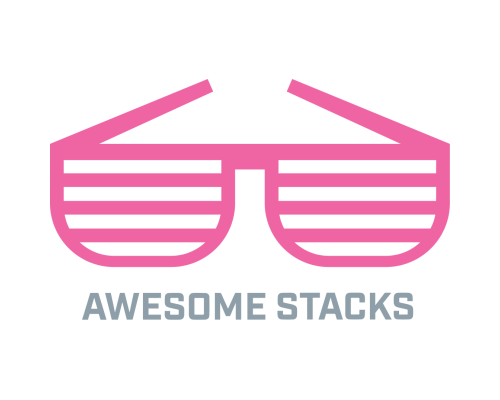

# Awesome Stacks

> Awesome tech stacks for all kinds of applications, inspired by [awesome.re](http://awesome.re).

Awesome Stacks is a community-curated list of tech stacks for building different applications and features. It is open source and inspired by the original [awesome list](http://awesome.re/).

Each stack in the list has a name, description, and list of a few of the key tools and technologies. Optionally, it links to a tutorial, starter kit or boilerplate that makes it easy to get started with.

Got a stack you think is a great way to build something? Please edit this file and add it! Check out [CONTRIBUTING.md](CONTRIBUTING.md) for more information.

### Browsing the stacks

Stacks can be browsed in two places—on the README and on [awesomestacks.dev](https://awesomestacks.dev/). The site, built with Gatsby and React, displays logos and metrics about each tool listed in the README by pulling data from the GitHub and StackShare APIs.

# Contents

- [Blockchain stacks](#blockchain-stacks)
- [JAMStack stacks](#jamstack-stacks)
- [JavaScript stacks](#javascript-stacks)
- [Mobile application stacks](#mobile-application-stacks)
- [Serverless stacks](#serverless-stacks)
- [Web application stacks](#web-application-stacks)

### Legend

🛠 - StackShare tool profile 
🐙 - GitHub repository

## Blockchain stacks

### [Ethereum DApp stack](https://awesomestacks.dev/ethereum-d-app-stack)

A collection of tools for building decentralized applications on the Ethereum blockchain.

- [Solidity](https://solidity.readthedocs.io) - [🐙](https://github.com/ethereum/solidity) - Solidity is an object-oriented, high-level language for implementing smart contracts.
- [web3.js](https://web3js.readthedocs.io) - [🐙](https://github.com/ethereum/web3.js) - Ethereum JavaScript API.
- [Truffle](https://truffleframework.com/truffle) - [🐙](https://github.com/trufflesuite/truffle) - A world class development environment, testing framework and asset pipeline for blockchains using the Ethereum Virtual Machine (EVM).
- [Ganache](https://truffleframework.com/ganache) - [🐙](https://github.com/trufflesuite/ganache) - Personal blockchain for Ethereum development.
- [drizzle](https://truffleframework.com/drizzle) - [🐙](https://github.com/trufflesuite/drizzle) - A collection of front-end libraries that make writing dapp user interfaces easier and more predictable.

## JAMStack stacks

The [JAMStack](https://jamstack.org/) is a new way of building websites and apps that delivers better performance, higher security and a better developer experience.

### [PWA with Gatsby](https://awesomestacks.dev/pwa-with-gatsby)

Build a simple polling progressive web application with some great modern tech.

- [Gatsby](https://gatsbyjs.org/) - [🛠](https://stackshare.io/gatsbyjs) - [🐙](https://github.com/gatsbyjs/gatsby) - Gatsby is a blazing fast modern site generator for React.
- [Cloud Firestore](https://firebase.google.com/docs/firestore/) - [🛠️](https://stackshare.io/cloud-firestore) - A noSQL cloud database that exposes event listeners for real-time updates.
- [Netlify](https://netlify.com/) - [🛠️](https://stackshare.io/netlify) - Netlify is a global CDN that makes continuous deployments as simple as a few clicks.
- [styled components](https://www.styled-components.com/) - [🛠](https://stackshare.io/styled-components) - [🐙](https://github.com/styled-components) - A react-specific css-in-js solution.

> Get the [code](https://medium.com/@UnicornAgency/jamstack-pwa-lets-build-a-polling-app-with-gatsby-js-firebase-and-styled-components-pt-1-78a03a633092)

### [Victor Hugo](https://awesomestacks.dev/victor-hugo)

Hugo is a static site generator written in Go with a focus on speed and convention. Victor Hugo adds a full asset pipeline.

- [Hugo](https://gohugo.io/) - [🛠](https://stackshare.io/hugo_2)- [🐙](https://github.com/gohugoio/hugo) - The world’s fastest framework for building websites.
- [Webpack](https://webpack.js.org/) - [🛠️](https://stackshare.io/webpack) - [🐙](https://github.com/webpack/webpack) - A static module bundler for modern JavaScript applications.
- [Babel](https://babeljs.io/) - [🛠️](https://stackshare.io/babel) - [🐙](https://github.com/babel/babel) - A JavaScript compiler; use next generation JavaScript, today.
- [PostCSS](https://postcss.org/) - [🛠](https://stackshare.io/postcss) - [🐙](https://github.com/postcss/postcss) - A tool for transforming CSS with JavaScript.

> Get the [code](https://github.com/netlify-templates/victor-hugo)

### [Algolia site search](https://awesomestacks.dev/algolia-site-search)

Add search to your JAMStack website, through a static site integration or by crawling the content.

- [Algolia](https://algolia.com/) - [🛠](https://stackshare.io/algolia) - Hosted search API, free up to 10,000 records.
- [DocSearch](https://community.algolia.com/docsearch) - [🐙](https://github.com/algolia/docsearch-scraper) - Crawls a website and uploads it to an index.
- [gatsby-plugin-algolia](https://www.gatsbyjs.org/packages/gatsby-plugin-algolia/) - [🐙](https://github.com/algolia/gatsby-plugin-algolia) - Use GraphQL to specify Gatsby object to index with Algolia (beta).
- [hugo-algolia](https://www.gatsbyjs.org/packages/gatsby-plugin-algolia/) - [🐙](https://github.com/replicatedhq/hugo-algolia) - Generate and send indices from Hugo static sites for use with Algolia.
- [instantsearch.js](https://www.algolia.com/doc/guides/building-search-ui/what-is-instantsearch/js/) - [🐙](https://github.com/algolia/instantsearch.js) - JavaScript library for building performant and instant search experiences.

> See a [tutorial](https://forestry.io/blog/search-with-algolia-in-hugo/)

## JavaScript stacks

### [React starter kit](https://awesomestacks.dev/react-starter-kit)

A set of tools that work well for building isomorphic web apps with GraphQL support.

- [React](https://reactjs.org/) - [🛠](https://stackshare.io/react) - [🐙](https://github.com/facebook/react) - React components can be used on the client and server side.
- [Babel](https://babeljs.io/) - [🛠️](https://stackshare.io/babel) - [🐙](https://github.com/babel/babel) - A JavaScript compiler; use next generation JavaScript, today.
- [Webpack](https://webpack.js.org/) - [🛠️](https://stackshare.io/webpack) - [🐙](https://github.com/webpack/webpack) - A static module bundler for modern JavaScript applications.
- [Express](https://expressjs.com/) - [🛠️](https://stackshare.io/expressjs) - [🐙](https://github.com/expressjs/express) - A minimal and flexible Node.js web application framework.
- [Node.js](https://nodejs.org/) - [🛠️](https://stackshare.io/nodejs) - [🐙](https://github.com/nodejs/node) - A JavaScript runtime built on Chrome's V8 JavaScript engine.
- [GraphQL](https://graphql.org/) - [🛠](https://stackshare.io/graphql) - [🐙](https://github.com/graphql/graphql-js) - A query language for APIs and a runtime for fulfilling those queries with your existing data.

> Get the [code](https://github.com/kriasoft/react-starter-kit)

### [React Firebase starter](https://awesomestacks.dev/react-firebase-starter)

A serverless project template based on Firebase and React; deploys easily to Google Cloud.

- [Firebase](https://firebase.google.com/) - [🛠️](https://stackshare.io/firebase) - A cloud-hosted NoSQL database that lets you store and sync data between your users in realtime.
- [Create React App](https://facebook.github.io/create-react-app/) - [🛠](https://stackshare.io/create-react-app) - [🐙](facebook/create-react-app) - Set up a modern web app by running one command.
- [Material UI](https://material-ui.com/) - [🛠️](https://stackshare.io/material-ui) - [🐙](https://github.com/mui-org/material-ui) - React components that implement Google's Material Design.
- [Relay](https://facebook.github.io/relay/) - [🛠️](https://stackshare.io/relay) - [🐙](https://github.com/facebook/relay) - A JavaScript framework for building data-driven React applications.
- [GraphQL](https://graphql.org/) - [🛠](https://stackshare.io/graphql) - [🐙](https://github.com/graphql/graphql-js) - A query language for APIs and a runtime for fulfilling those queries with your existing data.

> Get the [code](https://github.com/kriasoft/react-firebase-starter)

### [vue-starter](https://awesomestacks.dev/vue-starter)

The most complete boilerplate for production-ready PWAs. With focus on performance, development speed, and best practices.

- [Vue.js](https://vuejs.org/) - [🛠️](https://stackshare.io/vue-js) - [🐙](https://github.com/vuejs/vue) - An approachable core library that focuses on the view layer only.
- [TypeScript](https://www.typescriptlang.org/) - [🛠️](https://stackshare.io/typescript) - [🐙](https://github.com/Microsoft/TypeScript) - A typed superset of JavaScript that compiles to plain JavaScript.
- [Jest](https://jestjs.io/) - [🛠️](https://stackshare.io/jest) - [🐙](https://github.com/facebook/jest) - A comprehensive, delightful JavaScript testing solution.
- [Prettier](https://prettier.io/) - [🛠️](https://stackshare.io/prettier) - [🐙](https://github.com/prettier/prettier) - An opinionated code formatter.
- [Vuex](https://veux.vuejs.org/) - [🐙](https://github.com/vuejs/vuex) - Centralized State Management for Vue.js.
- [Vue Router](https://router.vuejs.org/) - [🐙](https://github.com/vuejs/vue-router) - Vue Router is the official router for Vue.js.

> Get the [code](https://vue-starter.herokuapp.com/docs/)

### [Vue Enterprise Boilerplate](https://awesomestacks.dev/vue-enterprise-boilerplate)

An ever-evolving and opinionated architecture and dev environment for new Vue SPA projects using Vue CLI 3. Well-documented an maintained by [Chris Fritz](https://github.com/chrisvfritz/vue-enterprise-boilerplate). 

- [Vue.js](https://vuejs.org/) - [🛠️](https://stackshare.io/vue-js) - [🐙](https://github.com/vuejs/vue) - An approachable core library that focuses on the view layer only.
- [Vuex](https://veux.vuejs.org/) - [🐙](https://github.com/vuejs/vuex) - Centralized State Management for Vue.js.
- [Vue Router](https://router.vuejs.org/) - [🐙](https://github.com/vuejs/vue-router) - Vue Router is the official router for Vue.js.
- [Vue CLI](https://cli.vuejs.org/) - [🐙](https://github.com/vuejs/vue-cli) - An approachable core library that focuses on the view layer only.
- [Babel](https://babeljs.io/) - [🛠️](https://stackshare.io/babel) - [🐙](https://github.com/babel/babel) - compiler for writing next generation JavaScript; Babel will turn your ES6+ code into ES5 friendly code, so you can start using it right now without waiting for browser support.
- [Sass](https://sass-lang.com) - [🛠️](https://stackshare.io/sass) - [🐙](https://github.com/sass/sass) - Sass is an extension of CSS3, adding nested rules, variables, mixins, selector inheritance, and more. It's translated to well-formatted, standard CSS using the command line tool or a web-framework plugin.

## Mobile application stacks

### [React Native with Expo and Hasura](https://awesomestacks.dev/react-native-with-expo-and-hasura)

Hasura is an open source GraphQL engine that deploys instant, realtime GraphQL APIs on any Postgres database. This React Native stack uses Hasura droplets hosted on Digital Ocean.

- [Hasura](https://hasura.io/) - [🛠️](https://stackshare.io/hasura) - [🐙](https://github.com/hasura/graphql-engine) - Blazing fast, instant realtime GraphQL APIs on Postgres with fine grained access control.
- [React Native](https://facebook.github.io/react-native/) - [🛠️](https://stackshare.io/react-native) - [🐙](https://github.com/facebook/react-native) - Build native mobile apps using JavaScript and React.
- [Expo](https://expo.io/) - [🛠️](https://stackshare.io/expo) - [🐙](https://github.com/expo/expo) - Build, deploy, and quickly iterate on native iOS and Android apps from the same JavaScript codebase.
- [Digital Ocean](https://www.digitalocean.com/) - [🛠️](https://stackshare.io/digitalocean) - [🐙](https://github.com/digitalocean/) - Deploy an SSD cloud server in less than 55 seconds with a dedicated IP and root access.
- [Auth0](https://auth0.com/) - [🛠️](https://stackshare.io/auth0) - A universal authentication & authorization platform for web, mobile and legacy applications.

> [Guide: Hasura GraphQL Engine One-click App on DigitalOcean Marketplace](https://docs.hasura.io/1.0/graphql/manual/guides/deployment/digital-ocean-one-click.html)

> [Tutorial: Fullstack React Native with GraphQL and Authentication](https://blog.hasura.io/tutorial-fullstack-react-native-with-graphql-and-authentication-18183d13373a/)

### [React Native for the F8 App](https://awesomestacks.dev/react-native-for-the-f8-app)

Every year, as part of the F8 conference, Facebook builds iOS and Android apps that give attendees a schedule for the conference.

- [React Native](https://facebook.github.io/react-native/) - [🛠️](https://stackshare.io/react-native) - [🐙](https://github.com/facebook/react-native) - Build native mobile apps using JavaScript and React.
- [Parse Server](http://parseplatform.org/) - [🛠️](https://stackshare.io/parse-server) - [🐙](https://github.com/parse-community/parse-server) - Parse-compatible API server module for Node/Express.
- [Yarn](https://yarnpkg.org) - [🛠️](https://stackshare.io/yarn) - [🐙](https://github.com/yarnpkg/yarn) - Fast, reliable, and secure dependency management. 

> Get the [code](https://makeitopen.com/)

## Serverless stacks

### [Serverless Stack](https://awesomestacks.dev/serverless-stack)

Learn to Build Full-Stack Apps with Serverless and React on AWS.

- [Serverless Framework](https://serverless.com/) - [🛠️](https://stackshare.io/serverless) - [🐙](https://github.com/serverless/serverless) - A toolkit for building serverless applications.
- [AWS Lambda](https://aws.amazon.com/lambda) - [🛠️](https://stackshare.io/aws-lambda) - A compute service that runs your code in response to events.
- [DynamoDB](http://aws.amazon.com/dynamodb/) - [🛠️](https://stackshare.io/amazon-dynamodb) - Fully managed NoSQL database service.
- [Amazon Cognito](https://aws.amazon.com/cognito/) - [🛠️](https://stackshare.io/amazon-cognito) - Securely manage and synchronize app data for your users across their mobile devices.

> Get the [code](https://serverless-stack.com/)

## Web application stacks

### [MEVN: Mongo Express Vue Node](https://awesomestacks.dev/mevn-mongo-express-vue-node)

This is a full stack webapp boilerplate project with VueJS + ExpressJS + MongoDB.

- [Vue.js](https://vuejs.org/) - [🛠️](https://stackshare.io/vue-js) - [🐙](https://github.com/vuejs/vue) - An approachable core library that focuses on the view layer only.
- [MongoDB](https://www.mongodb.com/) - [🛠️](https://stackshare.io/mongodb) - [🐙](https://github.com/mongodb/mongo) - A document and JSON-oriented database.
- [Express](https://expressjs.com/) - [🛠️](https://stackshare.io/expressjs) - [🐙](https://github.com/expressjs/express) - A minimal and flexible Node.js web application framework.
- [Node.js](https://nodejs.org/en/) - [🛠️](https://stackshare.io/nodejs) - [🐙](https://github.com/nodejs/node) - Node.js is a JavaScript runtime built on Chrome's V8 JavaScript engine.

> Get the [code](http://vemapp.moleculer.services/)

# Contributing

See [CONTRIBUTING.md](./CONTRIBUTING.md) for information and guides on how to contribute stacks and tools.
